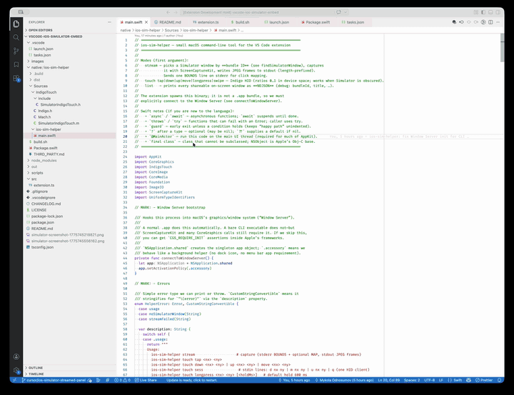

# iOS Simulator (streamed panel)

**macOS only.** This extension does not run on Linux or Windows.

VS Code / Cursor extension that streams the iOS Simulator window into a webview via **ScreenCaptureKit** and sends **taps** with **SimulatorKit Indigo HID** (private SPI), so touches reach the booted simulator even when its window is **behind other apps**.

This is not true window embedding; it is a live JPEG stream plus host-side HID injection.

**Source:** [github.com/mkloouo/vscode-ios-simulator-embed](https://github.com/mkloouo/vscode-ios-simulator-embed)

## Demo

Screen recording converted to GIF (first ~28s, 720px wide). Streamed panel with touch forwarding to a booted simulator.



## Setup

1. **Xcode** (not only CLT): the helper links **CoreSimulator** and **SimulatorKit** from your active developer dir (`xcode-select -p`).
2. From the repo root:

   ```bash
   npm install
   npm run compile
   npm run build:native
   ```

   `build:native` runs [`native/ios-sim-helper/build.sh`](native/ios-sim-helper/build.sh), which adds framework search paths and **rpath** so the binary finds those frameworks at runtime.

3. Open this folder in VS Code or Cursor, run **Run Extension** (F5).

4. Command Palette: **iOS Simulator: Start streamed panel** (stop with **Stop streamed panel**).

5. With **multiple booted simulators**, run **iOS Simulator: Select booted simulator (UDID)** so MAP, touches, and screenshots target one device.

## Choosing the right window (stream) and device (touch)

**Stream** — windows are filtered by **owning bundle ID** (not title):

1. **iOS Simulator: List capture windows (debug)** → Output **“iOS Simulator Embed”** (NDJSON, largest first).
2. Set **Target Bundle Id** (`ios-simulator-embed.targetBundleId`) or env `IOS_SIM_HELPER_BUNDLE_ID`.

**Touch / MAP / screenshot device** — targets a **booted** simulator via CoreSimulator and `simctl`:

- If only one simulator is booted, you can leave **Simulator Udid** empty.
- If several are booted, use **iOS Simulator: Select booted simulator (UDID)** (writes User setting `ios-simulator-embed.simulatorUdid`) or set env `IOS_SIM_UDID` manually.

**Coordinates** — webview clicks are turned into **normalized (0–1, top-left)** positions over the streamed image. That matches Indigo’s ratio space for the **device surface** only approximately when the JPEG includes window chrome; adjust or crop later if needed.

## macOS permissions

- **Screen Recording**: allow the app that hosts the Extension Host (Cursor / VS Code) for capture.
- **Accessibility** (Automation): **not** required for stream touches (Indigo HID), but **required** for the panel toolbar shortcuts (Home, Rotate) which drive **Simulator** via **System Events** / AppleScript. **Screenshot** uses `simctl` only.

## Spaces (Mission Control / virtual desktops)

ScreenCaptureKit only sees windows on the **same Space** as the app that runs the extension host (Cursor / VS Code). If the Simulator window is on **another desktop**, **start the stream will not capture it** until you move Simulator to the desktop where the editor is, then run **Start streamed panel** again.

After capture has started successfully, you can **move Simulator to another Space**; the **stream and touch forwarding** usually keep working. The **three toolbar buttons** (Home, Screenshot, Rotate) **may stop working** in that situation: they rely on bringing the **on-screen** Simulator window to the front via AppleScript / `simctl`, which targets the Simulator instance on the **current** Space, not necessarily the one you are streaming.

## Private API / stability

Touch uses **undocumented** Apple frameworks and wire formats; Xcode/Simulator updates can break this. See [`native/ios-sim-helper/THIRD_PARTY.md`](native/ios-sim-helper/THIRD_PARTY.md).

## Limits

- **Performance**: ~12 FPS capture + coalesced webview updates; still CPU-heavy. Use setting **streamJpegQuality** to trade quality vs bandwidth.
- **Packaging**: `vscode:prepublish` runs `scripts/stage-native-helper.sh`, which copies `.build/release/ios-sim-helper` into `native/ios-sim-helper/dist/` (the VSIX includes `dist` and ignores SwiftPM `.build`). Run **`npm run build:native`** before packaging. **`npm run release -- patch`** (or `minor` / `major`, or an exact **`1.2.3`**) requires a clean git tree: it bumps `package.json`, creates a **`chore(release): …`** commit and **`vX.Y.Z`** tag, then runs **`vsce package`**. Shorthand: **`npm run release:patch`**. Ship **arm64** (and **x86_64** if you build a universal binary) for your users’ Macs.

## Native helper CLI

`native/ios-sim-helper/.build/release/ios-sim-helper`:

- `stream` — stderr `BOUNDS:…`, stdout length-prefixed JPEG. Env `IOS_SIM_HELPER_BUNDLE_ID` optional.
- `touch tap <nx> <ny>` — Indigo tap; `nx`,`ny` in `[0,1]` from top-left of the simulated display. Env `IOS_SIM_UDID` optional.
- `list` — NDJSON of shareable macOS windows (debug bundle IDs for streaming).

## Extension icon

The Visual Studio Marketplace expects a **128×128 PNG** referenced by `package.json` as [`images/icon.png`](images/icon.png). The higher-resolution square source lives at [`images/icon-source.png`](images/icon-source.png) (re-export with `sips -z 128 128 images/icon-source.png --out images/icon.png` after edits).

## License

Copyright 2026 Mykola Odnosumov. Licensed under the **Apache License 2.0** (see [`LICENSE`](LICENSE)). Portions of the native helper are derived from Meta [idb](https://github.com/facebook/idb) (MIT); see [`native/ios-sim-helper/THIRD_PARTY.md`](native/ios-sim-helper/THIRD_PARTY.md).
